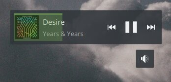

# Интеграция VK.com с MediaSession

> Этот юзерскрипт интегрирует плеер ВК с относительно новым [MediaSession API](https://w3c.github.io/mediasession/). Это весьма полезно если вы используете расширение интеграции с окружением рабочего стола (например, [Plasma Browser Integration для KDE](https://community.kde.org/Plasma/Browser_Integration)).

|             Без скрипта             |           Со скриптом            |
| :---------------------------------: | :------------------------------: |
|  |  |
| <ul><li>Невозможно полноценно управлять проигрыванием</li><li>Не отображается название трека и исполнитель</li></ul> | <ul><li>Динамично менающиеся элементы управления проигрыванием</li><li>Отображаемые обложка**1**, исполнитель, заголовок и альбом/плейлист</li></ul> |

1 *К сожалению, ВКонтакте не загружает информацию об альбоме при проигрывание треков из обычных плейлистов, доступна только маленькая обложка. Однако, если вы запустили проигрывание альбома, большая обложка будет загружена. Эту проблему невозможно исправить.*

## Как использовать этот скрипт?

Вам нужно будет установить юзерскрипт через предпочтительное расширение для этого ([Tampermonkey](https://www.tampermonkey.net/), [Greasemonkey](https://www.greasespot.net/), [Violentmonkey](https://violentmonkey.github.io/)). По нажатию на следующую кнопку должен открыться диалог установки.

**По-прежнему необходима системная интеграция, которая будет использовать эти данные**. KDE предоставляет расширение Plasma Browser Integration для Firefox и Chrome, которое использует MediaSession и мониторинг аудио и видео элементов на странице, чтобы предоставить вам элементы управления и отображать информацию о медиа. [Подробнее →](https://vk.com/@kde_ru-plasma-browser-integration-15)

## Сообщения об ошибках

Юзерскрипт полагается на расскрытое API на сайте ВКонтакте, к которому нет документации, поэтому оно может некорректно себя вести в некоторых ситуациях. Если у вас возникли проблемы с этим скриптом, пожалуйста сообщите о них в [секции Issues →](https://github.com/Sasha-Sorokin/vkaintegra/issues)
